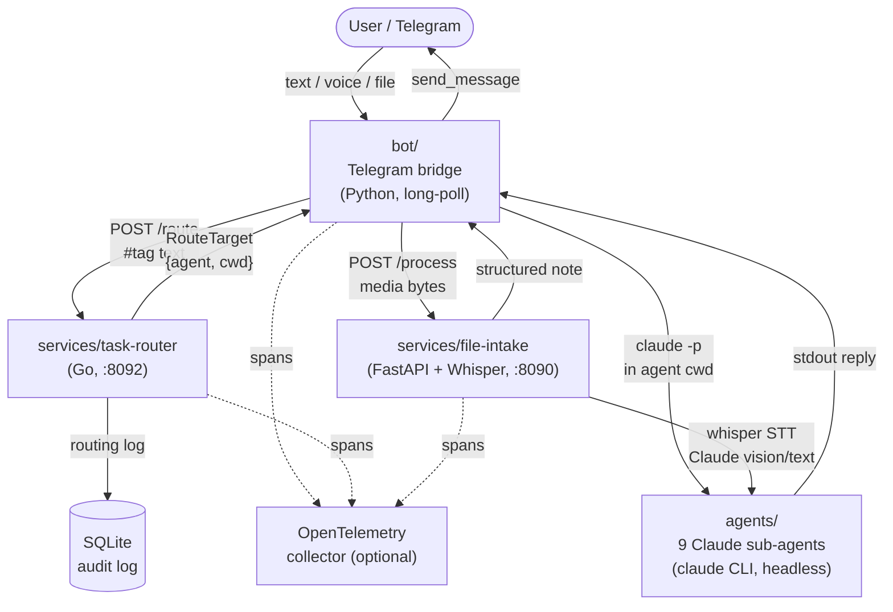

# Claude Agent Studio

[](https://github.com/your-org/claude-agent-studio/actions)
[](LICENSE)

**Claude Agent Studio** is an open-source reference architecture for orchestrating a team of
specialized Claude AI agents through a personal Telegram bot. You send a message; the bot
dispatches it to the right agent (architect, developer, reviewer, QA, docs, devops, …);
the agent runs `claude` CLI non-interactively and the reply comes back to your chat.

It is aimed at developers who want to run their own AI-agent studio on a self-hosted server
and prefer Telegram as the control plane rather than a web UI.

---

## Why this architecture?

- **Single entry point** — one Telegram chat controls the whole team. No separate dashboards.
- **Deterministic routing** — the task-router picks agents by tag matching, not by LLM guess.
- **Safety gate** — dangerous shell commands are intercepted and require explicit approval via
  Telegram inline buttons before they run.
- **File/voice support** — voice messages are transcribed (Whisper STT) and then processed by
  Claude. Images and PDFs are also handled.
- **Composable** — each component is an independently deployable Docker service. Add or remove
  agents by editing a YAML catalog; no code changes needed.

---

## Architecture



### Request flow

1. **User** sends a text, voice clip, image, or PDF to the Telegram bot.
2. **bot/** (tgbridge) receives the update via long-poll. For media it calls **file-intake**
   which transcribes / analyzes the content and returns structured text.
3. The bot posts the text to **task-router** (`POST /route`) with any `#tags` the user included.
4. **task-router** resolves the best agent using a two-path algorithm (fast-path: exact slug
   match; slow-path: tag-weight scoring) and returns a routing target.
5. The bot launches the target agent by running `claude -p <prompt>` in the agent's working
   directory (`AGENT_WORKDIR/<mode>`).
6. The agent's stdout is sent back to the Telegram chat.
7. If the agent issues a shell command classified as dangerous, **approval-hook.sh** fires,
   sends inline-button approval to Telegram, and blocks execution until the user responds.

---

## Components

### `bot/` — Telegram bridge

Python package (`tgbridge`) that acts as the dispatcher. Key capabilities:

- **Mode routing** — sticky mode per chat (`ask`, `dev`); switch with `/ask` or `/dev`.
  Specialist shortcuts: `/go`, `/py`, `/ts`, `/rev`, `/devops`, `/db`, `/docs`, `/qa`.
- **Task queue** — concurrent tasks with FIFO queue per mode; `/queue` and `/cancel` commands.
- **Live panel** — single inline message updated in place showing current mode and task status.
- **Approval gate** (`approval-hook.sh`) — PreToolUse hook for Claude. Classifies every shell
  command as `allow / ask / deny` (deny-first). On `ask`, sends inline buttons; on `deny`,
  blocks immediately. Timeout after 300 s → automatic deny.
- **Command classifier** (`classifier.py`) — pure function, no LLM call. Deny-first: bypass
  patterns first (piped eval, base64|sh), then denylist by command/flag, then read-only
  allowlist, finally `ask` for anything unknown. Each pipeline segment is checked independently.
- **Media forwarding** — voice, images, and documents are forwarded to file-intake for AI
  processing.

### `services/task-router/` — tag-based agent dispatcher (Go)

Deterministic HTTP microservice. It **never calls an LLM**; all routing is rule-based.

- **Registry** — in-memory inverted index of `tagcatalog/tags.yaml` (agents × tags × skills),
  rebuilt atomically on reload.
- **Parser** — extracts `#tags`, project slug, and free text from the request body.
- **Matcher** — fast-path (exact slug → O(1)) then slow-path (tag-weight scoring, linear).
- **Store** — SQLite audit log of every routing decision (pure-Go, no cgo).
- **HTTP API** — `POST /route`, `GET /agents`, `GET /health`, `GET /metrics`.
- **OTel** — optional OpenTelemetry tracing (graceful no-op when endpoint is not configured).

To add or modify agents, edit `services/task-router/tagcatalog/tags.yaml`. No rebuild needed;
the registry reloads on startup.

### `services/file-intake/` — file and voice processor (FastAPI)

FastAPI service that handles media sent through Telegram:

- **Voice / audio** — forwarded to a co-deployed **Whisper STT** container (`faster-whisper`).
  Transcription is returned as text and may be passed to Claude for further processing.
- **Images** — analyzed by Claude (vision API).
- **PDFs** — text extracted and summarized by Claude.
- The processed result is returned to the bot as structured text.
- Optional sink: a note-taking backend via its ETAPI (configured through `TRILIUM_*` env vars).
- Optional OTel tracing.

### `agents/` — Claude agent definitions

Nine YAML-frontmatter Markdown files, each describing one sub-agent:

| Agent | Model | Responsibility |
|---|---|---|
| `architect` | Claude Opus | Spec-driven design (OpenSpec): proposal → specs → ADR → tasks.md |
| `go-dev` | Claude Opus | Go services: concurrency, performance, gRPC/HTTP, observability |
| `python-dev` | Claude Sonnet | Python microservices (FastAPI/async), scripts |
| `ts-dev` | Claude Sonnet | TypeScript/React/Next.js frontend |
| `reviewer` | Claude Sonnet | Independent read-only code review |
| `devops` | Claude Sonnet | Docker/Compose, CI/CD, nginx, systemd |
| `db-engineer` | Claude Sonnet | ClickHouse schemas, SQL optimization, ETL |
| `docs` | Claude Sonnet | README, ADR, knowledge-base entries |
| `qa-test` | Claude Sonnet | pytest / go test / Vitest / Playwright |

The `agents/skills/architect/` subdirectory contains the **architect skill** (OpenSpec
reference and a `board.sh.example` script for optional task-board integration).

---

## Quick start

### Prerequisites

- Docker and Docker Compose
- An [Anthropic API key](https://console.anthropic.com/) (or a `claude` CLI OAuth token)
- A Telegram bot token (from [@BotFather](https://t.me/BotFather))
- Your personal Telegram chat ID (from [@userinfobot](https://t.me/userinfobot))

### Steps

```bash
# 1. Clone the repository
git clone https://github.com/your-org/claude-agent-studio.git
cd claude-agent-studio

# 2. Copy and edit the environment file
cp .env.example .env
chmod 600 .env
# Open .env and set at minimum:
#   TELEGRAM_TOKEN   — from @BotFather
#   TELEGRAM_CHAT_ID — your personal chat ID
#   ANTHROPIC_API_KEY — from console.anthropic.com
```

Then start all services:

```bash
make up
```

### Verify

```bash
# task-router health
curl http://localhost:8092/health

# file-intake health
curl http://localhost:8090/health

# Send /start to your Telegram bot — you should see the help message
```

### Stop

```bash
make down
```

---

## Configuration

All configuration is via environment variables. Copy `.env.example` to `.env` and fill in:

| Variable | Required | Description |
|---|---|---|
| `TELEGRAM_TOKEN` | Yes | Telegram bot token from @BotFather |
| `TELEGRAM_CHAT_ID` | Yes | Your personal Telegram chat ID |
| `ANTHROPIC_API_KEY` | Yes | Anthropic API key for Claude |
| `AGENT_WORKDIR` | Yes | Host path where agent mode directories live |
| `AGENT_IPC_DIR` | No | IPC directory for approval gate (default `/tmp/agent-studio`) |
| `AUTH_TOKEN` | No | Bearer token for file-intake `/process` endpoint |
| `MAX_FILE_MB` | No | Max upload size in MB (default 50) |
| `TG_ALLOWED_USER_IDS` | No | Comma-separated Telegram user IDs for file-intake |
| `WHISPER_MODEL` | No | Whisper model size: `tiny`, `base`, `small`, `medium` (default `small`) |
| `WHISPER_COMPUTE` | No | Whisper compute type: `int8`, `float16`, `float32` (default `int8`) |
| `WHISPER_LANGUAGE` | No | Language code for STT (default `en`) |
| `TR_PORT` | No | task-router port (default `8092`) |
| `OTEL_EXPORTER_OTLP_ENDPOINT` | No | OTLP endpoint for tracing; leave empty to disable |
| `TRILIUM_ETAPI` | No | Note-taking ETAPI base URL; leave empty to use stdout |
| `TRILIUM_TOKEN` | No | ETAPI token for note-taking backend |

See `.env.example` for the full list with comments.

---

## Repository structure

```
claude-agent-studio/
├── agents/                        # Claude sub-agent definitions (Markdown + YAML front-matter)
│   ├── architect.md
│   ├── go-dev.md
│   ├── python-dev.md
│   ├── ts-dev.md
│   ├── reviewer.md
│   ├── devops.md
│   ├── db-engineer.md
│   ├── docs.md
│   ├── qa-test.md
│   └── skills/architect/          # Architect skill: OpenSpec reference + board.sh.example
├── bot/                           # Telegram bridge (Python package: tgbridge)
│   ├── tgbridge/                  # Core package (app, handlers, state, workers, panel, …)
│   ├── approval-hook.sh           # PreToolUse hook: command classifier + approval gate
│   ├── classifier.py              # Deny-first command classifier (pure function)
│   ├── telegram-bridge.py         # Entry point
│   └── tests/                     # pytest test suite
├── services/
│   ├── task-router/               # Go microservice: tag-based agent routing
│   │   ├── internal/              # dispatcher, matcher, parser, registry, store, httpapi
│   │   ├── tagcatalog/            # tags.yaml (agents × tags × skills catalog)
│   │   └── migrations/            # SQLite DDL migrations
│   └── file-intake/               # FastAPI file/audio processor + Whisper STT
│       ├── app/                   # FastAPI app (handlers: audio, image, pdf)
│       └── whisper/               # faster-whisper HTTP server
├── docs/
│   └── architecture.md            # Extended architecture notes
├── docker-compose.yml             # Full stack: bot + task-router + file-intake + whisper
├── Makefile                       # up / down / build / test / lint / scan
├── .env.example                   # All environment variables with documentation
├── .gitignore
└── LICENSE                        # Apache-2.0
```

---

## Development

```bash
# Run all tests
make test

# Run linters
make lint

# Run secret scan (requires gitleaks or Docker)
make scan

# Build images without starting
make build
```

See [CONTRIBUTING.md](CONTRIBUTING.md) for the full development guide.

---

## License

Apache-2.0. See [LICENSE](LICENSE).

Contributions are welcome — see [CONTRIBUTING.md](CONTRIBUTING.md).  
Security issues — see [SECURITY.md](SECURITY.md).
